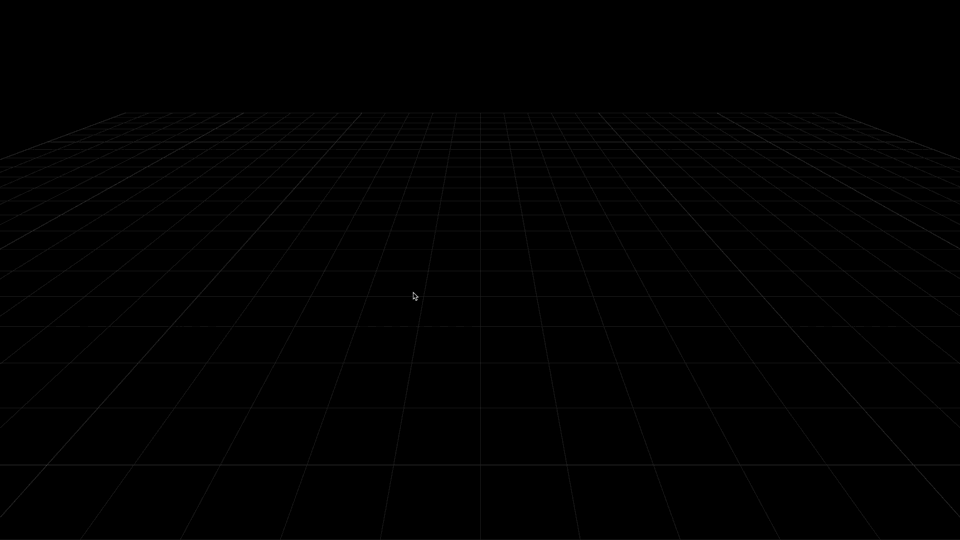
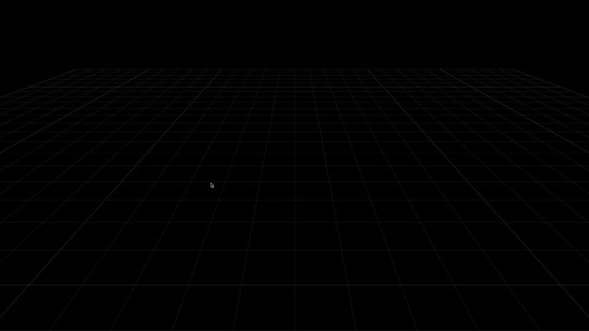
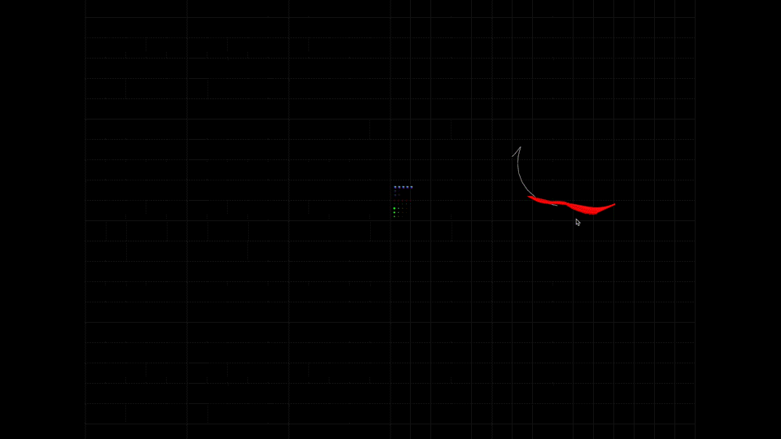
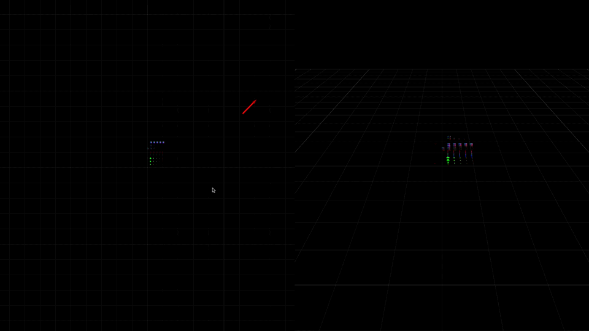

## Examples
### Running the examples locally
Running the examples locally requires a websocket connection.  
All the examples run smoothly with a publicly available backend available at this repository:  
https://github.com/rapyuta-robotics/zethus-demo-backend

The simplest way to run the backend is through docker
```
docker run -it -p 9090:9090 -p 8888:8888 rrdockerhub/zethus-backend:v1
```
This exposes a rosbridge server endpoint at port 9090.  
Once the backend is running, please navigate to the root directory and run the following commands
```
npm install
npm start
```
Visit http://localhost:9000/examples/

### Contents of the folder

#### Basic Example
Showcases the capabilities of inbuilt classes in Amphion to get started with minimal effort.  
In this example, we initialize a ROS instance and `Amphion.TfViewer`. Then add visualizations for path, marker and a robot model in less than 20 lines of code


#### 3D Viewer
An example of `Amphion.Viewer3d` which works similar to `Amphion.TfViewer` but does not subscribe to `/tf` and `/tf_static`.  
Visualizations added are placed at the origin


#### 2D Viewer
An example of `Amphion.Viewer2d` which has a top down camera with controls to zoom, pan and rotate in the 2d context


#### Custom View
An example of `Amphion.Scene` used with a custom renderer and controls


#### Custom Scene
An example of visualizations added to `THREE.Scene` with custom controls


#### Multiple views
An example of a single `Amphion.Scene` used with `Amphion.Viewer2d` and `Amphion.Viewer3d` rendered independently on two different containers

